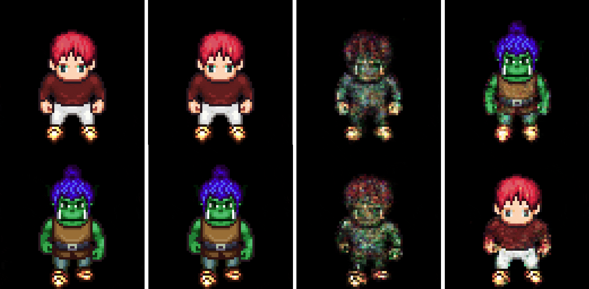
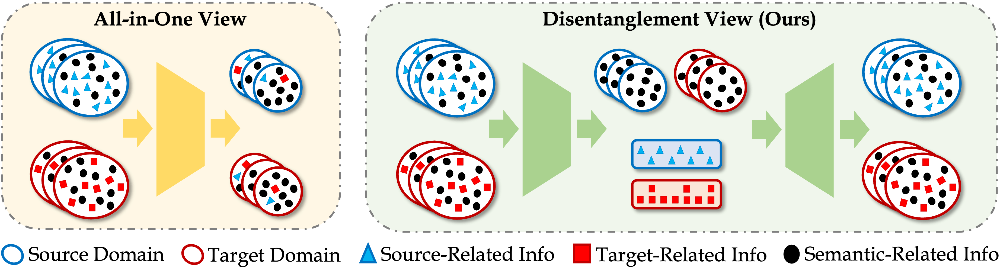
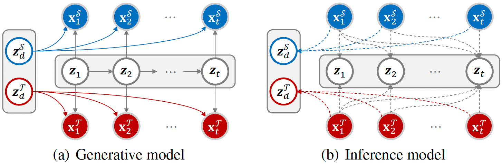
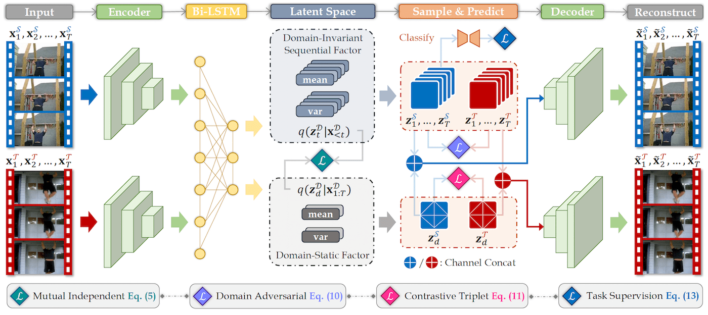
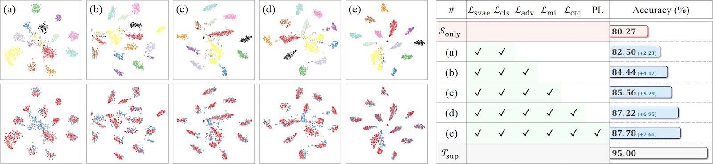

<br />
<p align="center">
  
  
  <h3 align="center"><strong>Unsupervised Video Domain Adaptation for Action Recognition:<br>A Disentanglement Perspective</strong></h3>

  <p align="center">
      <a href="https://scholar.google.com/citations?user=a94WthkAAAAJ" target='_blank'>Pengfei Wei</a><sup>1</sup>&nbsp;
      <a href="https://scholar.google.com/citations?user=-j1j7TkAAAAJ" target='_blank'>Lingdong Kong</a><sup>1,2</sup>&nbsp;
      <a href="https://scholar.google.com/citations?user=2PxlmU0AAAAJ" target='_blank'>Xinghua Qu</a><sup>1</sup>&nbsp;
      <a href="https://scholar.google.com/citations?user=e6_J-lEAAAAJ" target='_blank'>Xiang Yin</a><sup>1</sup>&nbsp;
      <a href="" target='_blank'>Zhiqiang Xu</a><sup>3</sup>&nbsp;
      <a href="https://scholar.google.com/citations?user=XFtCe08AAAAJ" target='_blank'>Jing Jiang</a><sup>4</sup>&nbsp;
      <a href="" target='_blank'>Zejun Ma</a><sup>1</sup>
    <br>
  <sup>1</sup>ByteDance AI Lab&nbsp;&nbsp;
  <sup>2</sup>National University of Singapore&nbsp;&nbsp;
  <sup>3</sup>MBZUAI&nbsp;&nbsp;
  <sup>4</sup>University of Technology Sydney
  </p>
</p>

<p align="center">
  <a href="https://arxiv.org/abs/2208.07365" target='_blank'>
    
  </a>
  
  <a href="https://ldkong.com/TranSVAE" target='_blank'>
    
  </a>
  
  <a href="https://huggingface.co/spaces/ldkong/TranSVAE" target='_blank'>
    
  </a>
  
  <a href="https://zhuanlan.zhihu.com/p/553169112" target='_blank'>
    
  </a>
  
  <a href="" target='_blank'>
    
  </a>
</p>

## About
**TranSVAE** is a disentanglement framework designed for **unsupervised video domain adaptation**. It aims at disentangling the domain information from the data during the adaptation process. We consider the generation of cross-domain videos from two sets of **latent factors**: one encoding the static **domain-related** information and another encoding the **temporal and semantic-related** information. Objectives are enforced to constrain these latent factors to achieve domain disentanglement and transfer.

<br>
<p align="center">
  
  <br>
  <strong>Col1:</strong> Original sequences ("Human" $\mathcal{D}=\mathbf{P}_1$ and "Alien" $\mathcal{D}=\mathbf{P}_2$); <strong>Col2:</strong> Sequence reconstructions; <strong>Col3:</strong> Reconstructed sequences using $z_1^{\mathcal{D}},...,z_T^{\mathcal{D}}$; <strong>Col4:</strong> Domain transferred sequences with exchanged $z_d^{\mathcal{D}}$.
</p>
<br>

Visit our [project page](https://ldkong.com/TranSVAE) to explore more details. :paw_prints:


## Updates

- [2022.08] - TranSVAE achieves 1st place among the UDA leaderboards of [UCF-HMDB](https://paperswithcode.com/sota/unsupervised-domain-adaptation-on-ucf-hmdb), [Jester](https://paperswithcode.com/sota/unsupervised-domain-adaptation-on-jester), and [Epic-Kitchens](https://paperswithcode.com/sota/unsupervised-domain-adaptation-on-epic), based on [Paper-with-Code](https://paperswithcode.com/paper/unsupervised-video-domain-adaptation-a).
- [2022.08] - Try a [Gradio demo](https://huggingface.co/spaces/ldkong/TranSVAE) for domain disentanglement in TranSVAE at Hugging Face Spaces! :hugs:
- [2022.08] - Our paper is available on arXiv, click [here](https://arxiv.org/abs/2208.07365) to check it out!


## Outline

- [Highlights](#highlights)
- [Installation](#installation)
- [Data Preparation](#data-preparation)
- [Getting Started](#getting-started)
- [Main Results](#main-results)
- [TODO List](#todo-list)
- [License](#license)
- [Acknowledgement](#acknowledgement)
- [Citation](#citation)


## Highlight

| <strong>Conceptual Comparison</strong> |
|:-:|
||
| <strong>Graphical Model</strong> |
||
| <strong>Framework Overview</strong> |
||

## Installation

Please refer to [INSTALL.md](docs/INSTALL.md) for the installation details.


## Data Preparation

Please refer to [DATA_PREPARE.md](docs/DATA_PREPARE.md) for the details to prepare the <sup>1</sup>[UCF<sub>101</sub>](https://www.crcv.ucf.edu/data/UCF101.php), <sup>2</sup>[HMDB<sub>51</sub>](https://serre-lab.clps.brown.edu/resource/hmdb-a-large-human-motion-database), <sup>3</sup>[Jester](https://20bn.com/datasets/jester), <sup>4</sup>[Epic-Kitchens](https://epic-kitchens.github.io/2021), and <sup>5</sup>[Sprites](https://github.com/YingzhenLi/Sprites) datasets.


## Getting Started

Please refer to [GET_STARTED.md](docs/GET_STARTED.md) to learn more usage about this codebase.


## Main Result

### UCF<sub>101</sub> - HMDB<sub>51</sub>
[](https://paperswithcode.com/sota/unsupervised-domain-adaptation-on-ucf-hmdb?p=unsupervised-video-domain-adaptation-a)
|        Method        |  Backbone  |  U<sub>101</sub> &#8594; H<sub>51</sub> | H<sub>51</sub> &#8594; U<sub>101</sub> | Average |
|---------------------:|:----------:|:-----:|:-----:|:-----:|
| DANN (JMLR'16)       | ResNet-101 | 75.28 | 76.36 | 75.82 |
| JAN  (ICML'17)       | ResNet-101 | 74.72 | 76.69 | 75.71 |
| AdaBN (PR'18)        | ResNet-101 | 72.22 | 77.41 | 74.82 |
| MCD (CVPR'18)        | ResNet-101 | 73.89 | 79.34 | 76.62 |
| TA<sup>3</sup>N (ICCV'19) | ResNet-101 | 78.33 | 81.79 | 80.06 |
| ABG (MM'20)          | ResNet-101 | 79.17 | 85.11 | 82.14 |
| TCoN (AAAI'20)       | ResNet-101 | 87.22 | 89.14 | 88.18 |
| MA<sup>2</sup>L-TD (WACV'22) | ResNet-101 | 85.00 | 86.59 | 85.80 |
| Source-only          |     I3D    | 80.27 | 88.79 | 84.53 |
| DANN (JMLR'16)       |     I3D    | 80.83 | 88.09 | 84.46 |
| ADDA (CVPR'17)       |     I3D    | 79.17 | 88.44 | 83.81 |
| TA<sup>3</sup>N (ICCV'19) |     I3D    | 81.38 | 90.54 | 85.96 |
| SAVA (ECCV'20)       |     I3D    | 82.22 | 91.24 | 86.73 |
| CoMix (NeurIPS'21)   |     I3D    | 86.66 | 93.87 | 90.22 |
| CO<sup>2</sup>A (WACV'22)    |     I3D    | 87.78 | 95.79 | 91.79 |
| **TranSVAE (Ours)**  |   **I3D**  | **87.78** | **98.95** | **93.37** |
| Oracle               |     I3D    | 95.00 | 96.85 | 95.93 |

### Jester
[](https://paperswithcode.com/sota/unsupervised-domain-adaptation-on-jester-1?p=unsupervised-video-domain-adaptation-a)
| Task |  Source-only  |  DANN | ADDA | TA<sup>3</sup>N | CoMix | **TranSVAE (Ours)** | Oracle |
|:----:|:-------------:|:-----:|:----:|:---------------:|:-----:|:-------------------:|:------:|
| **J**<sub>S</sub> &#8594; **J**<sub>T</sub> | 51.5 | 55.4 | 52.3 | 55.5 | 64.7 | **66.1** | 95.6 |

### Epic-Kitchens
[](https://paperswithcode.com/sota/unsupervised-domain-adaptation-on-jester-1?p=unsupervised-video-domain-adaptation-a)
| Task |  Source-only  |  DANN | ADDA | TA<sup>3</sup>N | CoMix | **TranSVAE (Ours)** | Oracle |
|:----:|:-------------:|:-----:|:----:|:---------------:|:-----:|:-------------------:|:------:|
| **D**<sub>1</sub> &#8594; **D**<sub>2</sub> | 32.8 | 37.7 | 35.4 | 34.2 | 42.9 | **50.5** | 64.0 |
| **D**<sub>1</sub> &#8594; **D**<sub>3</sub> | 34.1 | 36.6 | 34.9 | 37.4 | 40.9 | **50.3** | 63.7 |
| **D**<sub>2</sub> &#8594; **D**<sub>1</sub> | 35.4 | 38.3 | 36.3 | 40.9 | 38.6 | **50.3** | 57.0 |
| **D**<sub>2</sub> &#8594; **D**<sub>3</sub> | 39.1 | 41.9 | 40.8 | 42.8 | 45.2 | **58.6** | 63.7 |
| **D**<sub>3</sub> &#8594; **D**<sub>1</sub> | 34.6 | 38.8 | 36.1 | 39.9 | 42.3 | **48.0** | 57.0 |
| **D**<sub>3</sub> &#8594; **D**<sub>2</sub> | 35.8 | 42.1 | 41.4 | 44.2 | 49.2 | **58.0** | 64.0 |
|               Average                       | 35.3 | 39.2 | 37.4 | 39.9 | 43.2 | **52.6** | 61.5 |

### Ablation Study
<strong>UCF<sub>101</sub></strong> &#8594; <strong>HMDB<sub>51</sub></strong>
<br>


<strong>HMDB<sub>51</sub></strong> &#8594; <strong>UCF<sub>101</sub></strong>
<br>


<strong>Domain Transfer Example</strong>
<br>
| Source (Original) | Target (Original) |  | Source (Original) | Target (Original) |
| :-: | :-: | :-: | :-: | :-: |
|  |  |  |  |  |
| |
| Reconstruct ($\mathbf{z}_d^{\mathcal{S}}$ + $\mathbf{z}_t^{\mathcal{S}}$) | Reconstruct ($\mathbf{z}_d^{\mathcal{T}}$ + $\mathbf{z}_t^{\mathcal{T}}$) |  | Reconstruct ($\mathbf{z}_d^{\mathcal{S}}$ + $\mathbf{z}_t^{\mathcal{S}}$) | Reconstruct ($\mathbf{z}_d^{\mathcal{T}}$ + $\mathbf{z}_t^{\mathcal{T}}$) |
|  |  |  |  |  |
| |
| Reconstruct ($\mathbf{z}_d^{\mathcal{S}} + \mathbf{0}$) | Reconstruct ($\mathbf{z}_d^{\mathcal{T}} + \mathbf{0}$) |  | Reconstruct ($\mathbf{z}_d^{\mathcal{S}} + \mathbf{0}$) | Reconstruct ($\mathbf{z}_d^{\mathcal{T}} + \mathbf{0}$) | 
|  |  |  |  |  |
| |
| Reconstruct ($\mathbf{0} + \mathbf{z}_t^{\mathcal{S}}$) | Reconstruct ($\mathbf{0} + \mathbf{z}_t^{\mathcal{T}}$) |  | Reconstruct ($\mathbf{0} + \mathbf{z}_t^{\mathcal{S}}$) | Reconstruct ($\mathbf{0} + \mathbf{z}_t^{\mathcal{T}}$) | 
|  |  |  |  |  |
| |
| Reconstruct ($\mathbf{z}_d^{\mathcal{S}} + \mathbf{z}_t^{\mathcal{T}}$) | Reconstruct ($\mathbf{z}_d^{\mathcal{T}} + \mathbf{z}_t^{\mathcal{S}}$) |  | Reconstruct ($\mathbf{z}_d^{\mathcal{S}} + \mathbf{z}_t^{\mathcal{T}}$) | Reconstruct ($\mathbf{z}_d^{\mathcal{T}} + \mathbf{z}_t^{\mathcal{S}}$) | 
|  |  |  |  |  |


## TODO List

- [x] Initial release. 🚀
- [x] Add license. See [here](#license) for more details.
- [x] Add demo at Hugging Face Spaces.
- [x] Add installation details.
- [x] Add data preparation details.
- [x] Add evaluation details.
- [x] Add training details.


## License
<a rel="license" href="http://creativecommons.org/licenses/by-nc-sa/4.0/"></a>
<br />
This work is under the <a rel="license" href="http://creativecommons.org/licenses/by-nc-sa/4.0/">Creative Commons Attribution-NonCommercial-ShareAlike 4.0 International License</a>.


## Acknowledgement
We acknowledge the use of the following public resources during the course of this work: <sup>1</sup>[UCF<sub>101</sub>](https://www.crcv.ucf.edu/data/UCF101.php), <sup>2</sup>[HMDB<sub>51</sub>](https://serre-lab.clps.brown.edu/resource/hmdb-a-large-human-motion-database), <sup>3</sup>[Jester](https://20bn.com/datasets/jester), <sup>4</sup>[Epic-Kitchens](https://epic-kitchens.github.io/2021), <sup>5</sup>[Sprites](https://github.com/YingzhenLi/Sprites), <sup>6</sup>[I3D](https://github.com/piergiaj/pytorch-i3d), and <sup>7</sup>[TRN](https://github.com/zhoubolei/TRN-pytorch).


## Citation

If you find this work helpful, please kindly consider citing our paper:

```bibtex
@ARTICLE{wei2022transvae,
  title={Unsupervised Video Domain Adaptation: A Disentanglement Perspective},
  author={Wei, Pengfei and Kong, Lingdong and Qu, Xinghua and Yin, Xiang and Xu, Zhiqiang and Jiang, Jing and Ma, Zejun},
  journal={arXiv preprint arXiv:2208.07365}, 
  year={2022},
}
```
